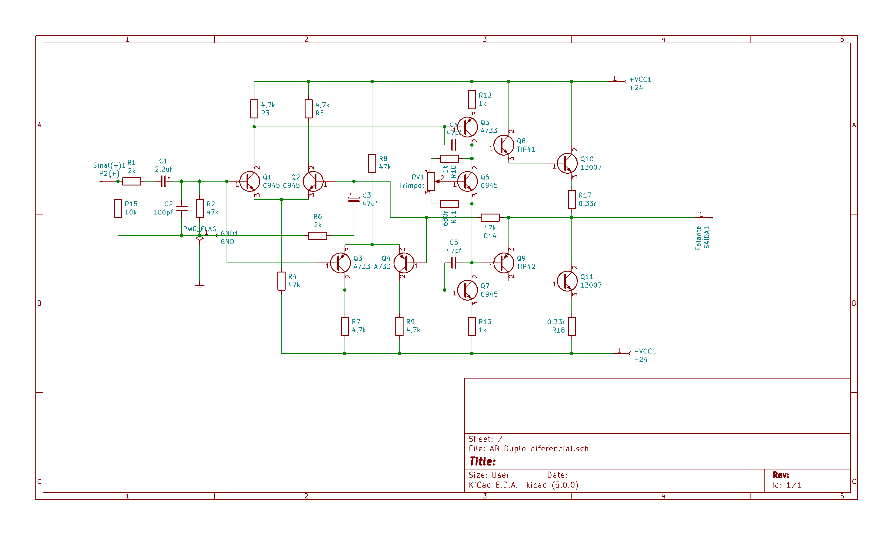
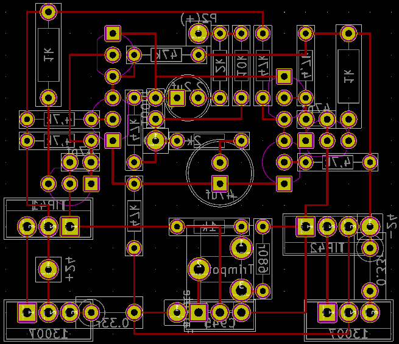

# 3.0_3.1 Beta
## SCHEME

## PCB
### ORIGINAL

### INVERTIDO HORIZONTALMENTE

## MODELO FÍSICO
### SUPERIOR
`versão não funcionou`3.1

`versão não funcionou`3.0

### INFERIOR
`versão não funcionou`3.1

`versão não funcionou`3.0

# 2.0
## SCHEME

## PCB
### ORIGINAL

### INVERTIDO HORIZONTALMENTE

## MODELO FÍSICO
### SUPERIOR

### INFERIOR

# 1.0
## SCHEME

## PCB
### ORIGINAL

### INVERTIDO HORIZONTALMENTE

## MODELO FÍSICO
### SUPERIOR
`INEXISTENTE`
### INFERIOR
`25-0-25`_1

`25-0-25`_2

